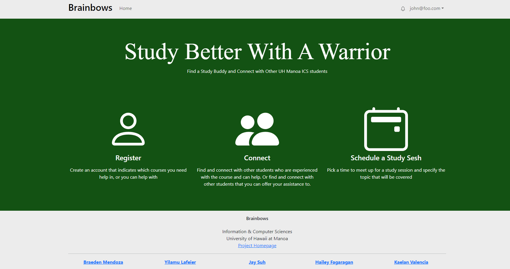

Our main idea with this whole project was to create a buddy messaging system where one could find and talk to other people that share the same major, but are in need of desperate help from others on a specific topic. We have implemented a wide variety of starter classes in the Computer Science department and we hope to expand it so that it includes classes for every topic at UH and not just the CS one. We understand that it's difficult to ask for help when you need it badly, whether that be because of fear of asking other people, maybe too nervous, or maybe they're embarrassed to ask others. We made it so that someone could recruit others to a study session and even chat with them to better plan for the study sessions and talk about specific topics that they may need help with. Every study session is on the calendar page, and usually recruitment happens from that page. And as a warning to some students or even a recommendation to others, we implemented a rating system for each student, so that others can see who’s a good study buddy and who they should probably avoid studying with! We want to encourage students to keep their goals fresh, and to always serve as a constant reminder to what they’re working so hard towards. Exactly why we have separate pages for both creating, updating, and looking at new and improved goals that students may have. And we understand how boring studying is. Trust me we’re students too, we also hate studying, which is why we wanted to create a little game-like system where there would be points that accumulate from every good study session review a person may have. And the more points they accumulate they get to be posted on the board! We’re currently brainstorming little rewards players. Ahem- students may receive after accumulating a certain amount of points!

I got to work with a wonderful group of my peers to tackle this project. I was in charge of creating a collections page full of all the students that create accounts and each student “card” would show what they need help with, and what classes they are more than qualified to teach others. Following that collection, I also implemented a rating system where students get to rate their peers based on how well of a teacher/student they were. Students get to see the average ratings of each student. On top of all of that I created a simple chatting system, where students can message one another, each chat is unique and so a chat with one student is completely different from a chat with another student. It also saves chats locally so you don’t have to worry about ever losing the data, and if you ever feel that you don’t like the message you sent them, there is a delete button to delete specific messages that were sent. Working with my fellow peers was a very enjoyable experience, usually coding by yourself is a tedious task and often something I put off until the end, but working with other people, there’s a sense of motivation that I can’t just let my teammates down and wait for me to finish a specific task so that they can finish theirs. I wanted them to not have to worry about other people and just work on their tasks.I’ve learned what it was like to work on an actual website with other people, this is the first time I’ve ever created an app, more less with other people working alongside me, and this experience will stay with me for a long time.

Here I'll put some code that illustrates how the rating system works and how it appears on the screen:

    

        <form onSubmit={handleSubmit}>
          {/* eslint-disable-next-line jsx-a11y/label-has-associated-control */}
          <label htmlFor={`rating-${id}`}>Rate this student:</label>
          

            {[...Array(5)].map((_, index) => {
              const ratingValue = index + 1;

            return (
              // eslint-disable-next-line jsx-a11y/label-has-associated-control
              <label htmlFor={`star-${id}-${ratingValue}`} className="star-wrapper" key={`star-${id}-${ratingValue}`}>
                <input
                  type="radio"
                  id={`star-${id}-${ratingValue}`}
                  name={`rating-${id}`}
                  value={ratingValue}
                  checked={ratingValue === value}
                  onChange={() => handleClick(ratingValue)}
                />
                <FaStar
                  className="star"
                  color={ratingValue <= value ? '#ffc107' : '#e4e5e9'}
                  size={20}
                />
              </label>
            );
          })}
        

You can learn more about [Brainbows here](https://brainbows.github.io).
