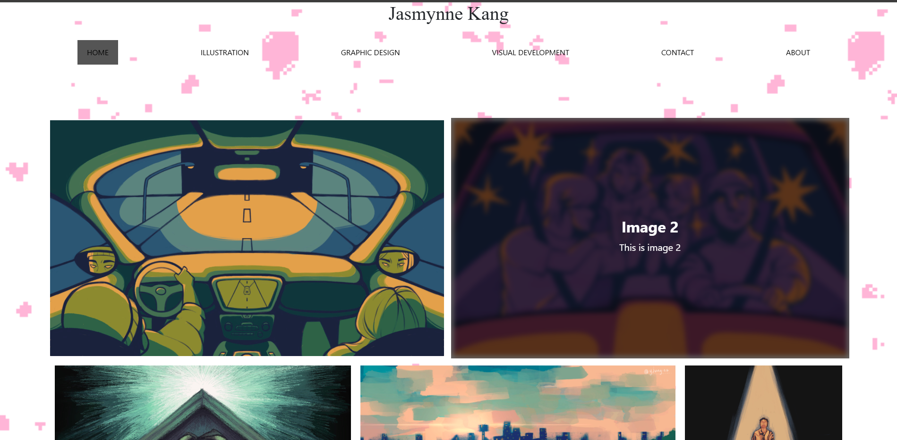
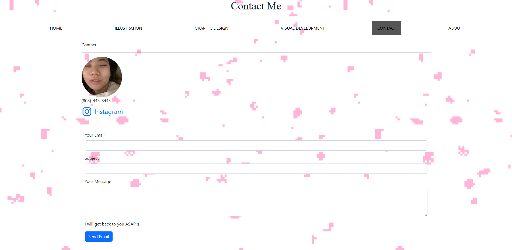

For this project I decided to make an art portfolio website for my wonderful girlfriend. For the website I included each type of art she creates and separated them into their own sections. For the main home page I decided to include every single art piece in a single page, and then separate them by topic afterward.

For each piece of art that is included I allowed it so that when the user hovers over the image with their cursor, a popup appears and shows the title of the piece as well as a brief description of the piece of art. The popup disappears when the user moves their cursor off of the image so that it isn't blocking their view of the work.

There is also an "About Me" page that describes her, her goals, interests, and overall information about her. There is also a contacts page where users can visit her art profiles on instagram and any other platform she uses to advertise her art. On this page users are also able to send her emails and call her through her phone number as well. Overall just a page to contact her. 

I included a piece of sample code providing how I implemented the popup descriptions on the images down below. 

          

      
        

          
Image 4

          
This is image 4

        

      

      
Link to portfolio Github https://github.com/JaySsuh/jazzPortfolio
