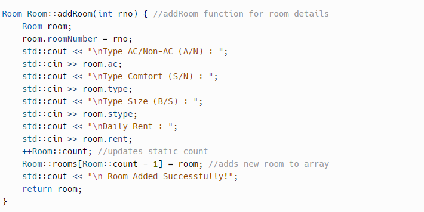

The goal of this project was to create a hotel management system, where we would create rooms with specific instructions such as, a room with A/C or no A/C, a room with a large or small bed, comfort of said room, and finally the daily rate that we as a hotel would charge the guest per day. We also had the option of adding more, or even deleting already existing rooms from the hotel itself. It's a simple, straightforward hotel managing system that anyone should be able to use.

Here is some code that illustrates the differnet types of options we are able to include in our hotel booking system:

  
