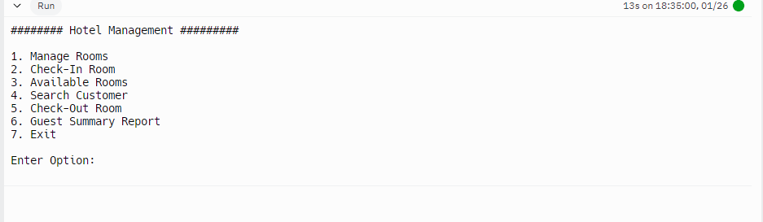

The goal of this project was to create a hotel management system, where we would create rooms with specific instructions such as, a room with A/C or no A/C, a room with a large or small bed, comfort of said room, and finally the daily rate that we as a hotel would charge the guest per day. We also would like to keep guest information into our booking system, in case they would like to come back to stay at our hotel again. We take information such as first and last name, their phone number. their address, as well as the room that they are currently staying in. If we do encounter complaints from the customer or any other customer, we could also just call up on the guests name, or their room number to pull up their details for the guest. When all is done, we are able to calculate the daily rate that is owed to us subtracted by the down payment made by the guest on arrival, and if the room were to encounter any problems, we could always remove the room from our books, so no guests are able to rent it.

This project is a simple hotel booking system, it was the largest project that I have had to work on thus far in my coding career. Luckily I was able to work with other people to tackle this projects, it was more practice to work with others on a large scale project and practice how to communicate what work we did through messaging or in class trying to catch our teammates up on what we worked on, and even explaining to them if they weren't able to understand how we coded something.

Here is some code that illustrates how the manager would input the room details, asking questions about the type of room that the guest prefers to stay in, and the daily rent that the manager would like to charge the guest:

    Room Room::addRoom(int rno) { //addRoom function for room details
        Room room;
        room.roomNumber = rno;
        std::cout << "\nType AC/Non-AC (A/N) : ";
        std::cin >> room.ac;
        std::cout << "\nType Comfort (S/N) : ";
        std::cin >> room.type;
        std::cout << "\nType Size (B/S) : ";
        std::cin >> room.stype;
        std::cout << "\nDaily Rent : ";
        std::cin >> room.rent;
        ++Room::count; //updates static count
        Room::rooms[Room::count - 1] = room; //adds new room to array
        std::cout << "\n Room Added Successfully!";
        return room;
    }

You can learn more about the [hotel managing system](https://github.com/JaySsuh/hotel/tree/main).
