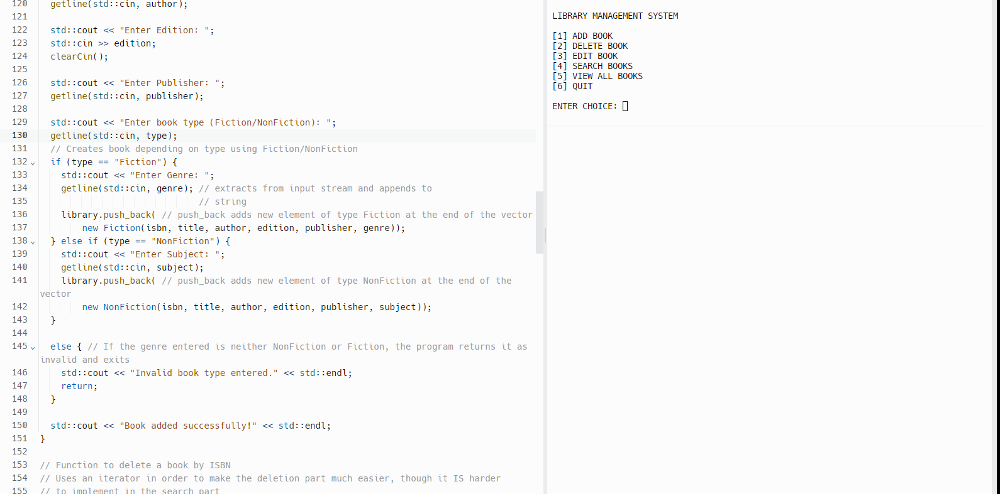

The goal of this project was to create a library system, where we can easily categorize books that we the librarian put in. After inputting something into our library, it shows the user the edition, publisher, author, genrem and the date that the book was published. We can also remove books that we no longer carry with us.

My part in this somewhat large coding assignment was to work on the book class, finishing the protected variables, and most of the public constructors using getters and setters. This project was one of the first projects where I had to work with my fellow classmates in order to tackle, from what I thought at the time was a large scale project. Since I was still relatively new to C/C++ this was a great learning experience about the language and how to work with others on a project.

Here is some code that illustrates the librarian inputting the book, and filling out all of the specific categories of the book:

      void addBook(std::vector<Book *> &library) {
      int isbn, edition;
      std::string title, author, publisher, type, genre, subject;
    
      //Take each user input (Including Genre)
      std::cout << "Enter ISBN: ";
      std::cin >> isbn;
      clearCin(); // clears input to continue prompt
    
      std::cout << "Enter Title: ";
      getline(std::cin, title);
    
      std::cout << "Enter Author: ";
      getline(std::cin, author);
    
      std::cout << "Enter Edition: ";
      std::cin >> edition;
      clearCin();
    
      std::cout << "Enter Publisher: ";
      getline(std::cin, publisher);
    
      std::cout << "Enter book type (Fiction/NonFiction): ";
      getline(std::cin, type);
      // Creates book depending on type using Fiction/NonFiction
      if (type == "Fiction") {
        std::cout << "Enter Genre: ";
        getline(std::cin, genre); // extracts from input stream and appends to
                                  // string
        library.push_back( // push_back adds new element of type Fiction at the end of the vector
            new Fiction(isbn, title, author, edition, publisher, genre));
      } else if (type == "NonFiction") {
        std::cout << "Enter Subject: ";
        getline(std::cin, subject);
        library.push_back( // push_back adds new element of type NonFiction at the end of the vector
            new NonFiction(isbn, title, author, edition, publisher, subject));
      } 
    
      else { // If the genre entered is neither NonFiction or Fiction, the program returns it as invalid and exits
        std::cout << "Invalid book type entered." << std::endl;
        return;
      }
    
      std::cout << "Book added successfully!" << std::endl;
    }

  
https://github.com/JaySsuh/library-management/tree/main
