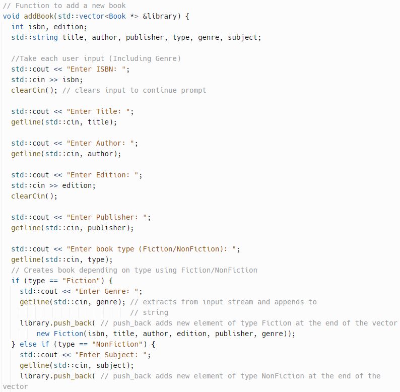

The goal of this project was to create a library system, where we can easily categorize books that we the librarian put in. After inputting something into our library, it shows the user the edition, publisher, author, genrem and the date that the book was published. We can also remove books that we no longer carry with us.

Here is some code that illustrates the librarian inputting the book, and filling out all of the specific categories of the book:

  
  
https://github.com/JaySsuh/library-management/tree/main
